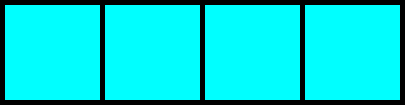
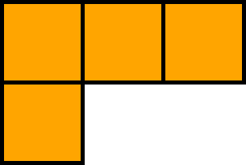
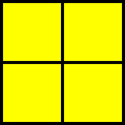
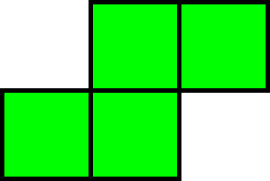
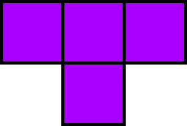
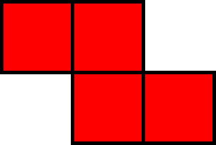
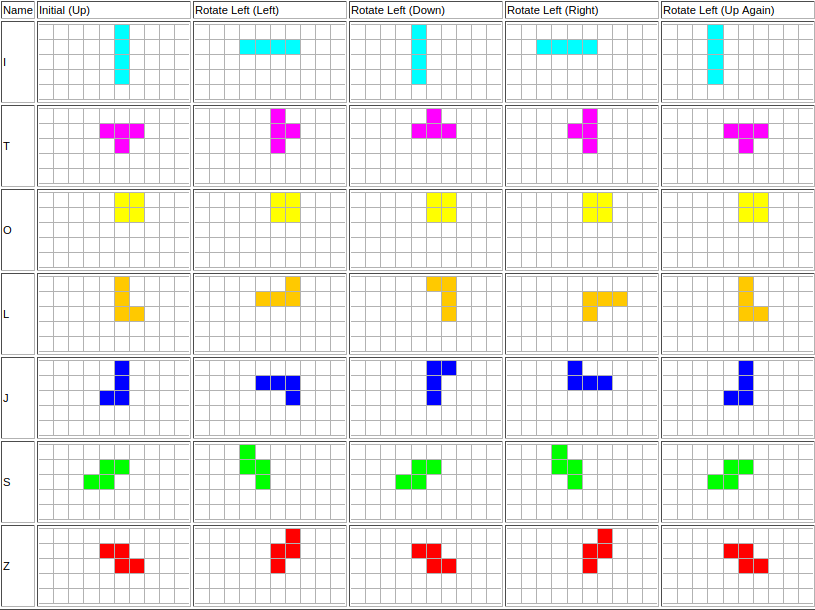
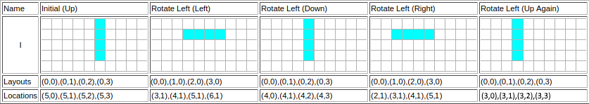
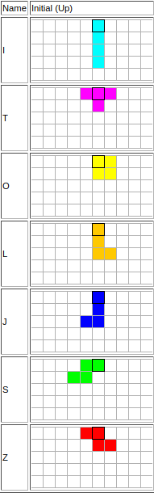

# Project 1: Tetris Game
## Due Date: Jun 11, 2021 11:59 PM
## Assignment Type: Closed [(see policy)](http://www.cs.umd.edu/class/summer2019/cmsc132/openClosedPolicy.shtml)

# Overview
For this project, you will implement code for the Tetris game. The graphical user interface has been provided to you in a package called **gui**. No part of the assignment involves you making any changes to code in this package. You will be implementing some of the functionality for the Tetris game by modifying classes provided to you in the **model** package.

# Objectives
This project will allow you to practice two-dimensional arrays, abstract classes, inheritance, and test development.

# Grading
* Public Tests (50%)
* Release Tests (40%)
* Style (10%)

# Code Distribution
You are provided with the following packages:
* gui - Represents the graphical user interface for the game. Executing the main method of the GameGUI class in this package will launch the user interface (assuming your code compiles successfully).
* model - Includes the classes you need to implement.
* tests - Includes the public tests. You should add your student test class to this package.

# Tetromino
A tetromino is a game piece that can have one of seven shapes, each with a distinct color as shown in the table below.

| Tetromino/Piece    | Shape  | Color |
|:------------------:|:------:|:-----:|
|I                   ||Cyan|
|J                   ||Blue|
|L                   ||Orange|
|O                   ||Yellow|
|S                   ||Green|
|T                   ||Purple|
|Z                   ||Red|

## Layout and Rotation
The layout of a tetromino represents its shape. When a tetromino rotates, its layout changes. Each tetromino has 4 layouts: up, left, down and right. When originally created, a tetromino is in the **up** layout. After one left rotation, it shifts to the **left** layout. After a second left rotation, it shifts to the **down** layout. After a third left rotation, it shifts to the **right** layout. Finally, after a fourth left rotation, it returns to a **up** layout. This sequence can be repeated by pressing z during game play. After going from the up layout to the up layout again, i.e in one full rotation through each 90 degree phase, all tetromino's except from the I tetromino should occupy the same column coordinate as they did initially (If they have been moved down in during the rotation, their row coordinate may have changed). The I tetromino, however, should move left by one position after one complete counter-clockwise rotation. Therefore, the "rotation" of a I tetromino is really a translation, with each full rotation moving it one column closer to the left of the game board.

The diagram below shows the progression of each tetromino as you rotate counter-clockwise by 90 degrees.

## Location
Although the layout of a tetromino is set (because its shape is set) for each of the 4 possible orientations, the location of a layed out tetromino will change due to rotation and moving the tetromino left/right. The diagram below illustrates this for the I tetromino.

## Initial Positions
So the inital position of each piece is relative to the size of the board.
One way to think about it is, there is a desginanted spot on each piece which 
is to be placed in the center of the board and the rest of the piece is to built
 around that. The center of the board is always at index Floor(MaxCols / 2).

Here is an example for a game board that has 10 columns:

The black square represents the column that is index Floor(10 / 2) *(ie 5)*

# Game Play
A random sequence of Tetrominos will fall down the playing field from the centre. The goal of the game is to fill the gaps horizontally. When an entire row is filled, the rows above it will collapse down by one row. A player can move a tetromino left/right using the corresponding arrow keys. They can also rotate the  tetromino left (counter-clockwise) 90 degrees at a time by pressing the z key.

Some things to note are:
* When a tetromino is moved left/right or rotated, the destination cells must be empty.
* Although the size of the  game board is 22 rows and 10 columns, your implementation should not depend on this (it would be a bad idea to hard code these numbers anywhere in your code). It should work correctly even if those dimensions are changed.
* Take note of where each tetromino is inserted into the board. This can be done by going through the public tests, however usually the heuristic is top left square of each piece is placed in the center of the board. 
* The game ends when a new piece cannot be placed onto the board. 

You can watch a video of the completed game being played [here](https://www.youtube.com/watch?v=ZTSXeSgZFtQ&feature=youtu.be). For more information about Tetris, click [here](https://en.wikipedia.org/wiki/Tetris).

# Specification
You are expected to implement methods for the Tetromino, I, J, L, O, S, T and Z classes. The other classes have been provided and you should not modify them. You should familiarize yourself with the Tetris Class.

# Requirements/Project Policies
* You may not add any classes, but feel free to add any instance variables and private methods you understand are necessary.
* See [Style Guidelines](http://www.cs.umd.edu/class/summer2017/cmsc132/resources/StyleGuidelines.html) for information regarding style.
* We cannot provide any information regarding release and secret tests. Once your project has been graded, you can see a TA if you would like to find out why you failed a release or secret test.

# Testing
We encourage you to run the game GUI and interact with the game. However, such an interaction is not guaranteed to test the full range of your code. As such, we also encourage you to write student tests. Student tests demonstrating a particular issue you are encountering with your code will be requested upon seeking help during office hours.

# Submission
To submit your project, zip the project folder and upload the zipped file to gradescope.

# Tips on Getting Started
You have been provided with a class to represent each possible Tetris piece (a tetromino). We suggest that you start with the simplest tetromino (like O or I).

Also:
* Processing the movement are same for all tetrominos. Therefore, they can be implemented in the Tetromino class.
* Each layout if a tetrimino can be represented as the top-left cell position (0,0) and relative locations of other cells.
* Location is the location of the tetromino on the game board.
* X is horizontal axis and the Y is the vertial axis.
* Successful left or right move updates the location.
* Successful rotation updates the layout and location

# Academic Integrity
Please make sure you read the academic integrity section of the syllabus so you understand what is permissible in our programming projects. We want to remind you that we check your project against other students' projects and any case of academic dishonesty will be referred to the Office of Student Conduct. 
