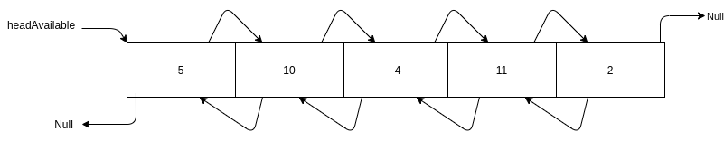
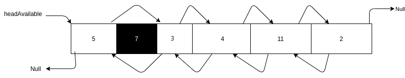
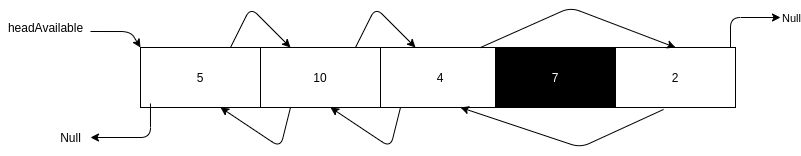
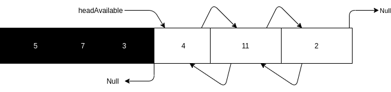
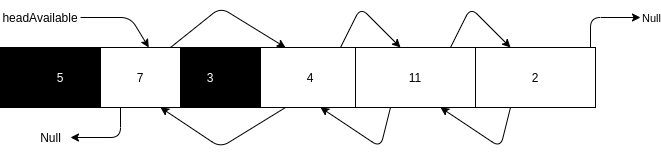
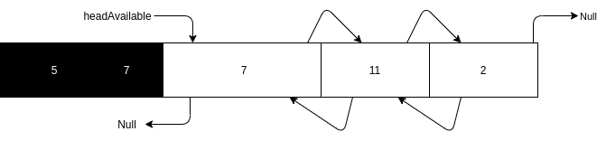
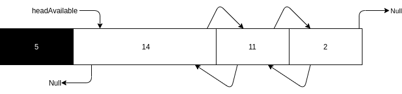

# Project 3: Memory Management
## Due Date: July 1, 2021 11:59 PM
## Assignment Type: Closed [(see policy)](http://www.cs.umd.edu/class/summer2019/cmsc132/openClosedPolicy.shtml)

# Overview
In this assignment, you will use a doubly linked list to manage blocks of memory. After successfully completing the assignment, you will be able to allocate and deallocate memory upon request.

# Objectives
This project will allow you to practice doubly linked lists and familiarize you with some concepts involved with explicit memory management.

# Background
In order to store information on a computer, contiguous memory space must be reserved and marked for certain data. This process is called Allocation. When information is deleted, it is called deallocation, and it marks memory space as free or available for use. This project will implement a simplified recreation of this memory management, using a doubly linked list to keep track of what memory is allocated and what memory is free.

# Manager Class
The manager class is in charge of handling memory allocation/deallocation and performing the necessary bookkeeping required to do so. The constructor of this class
accepts an array of integers that represents the starting size of each block of memory. The blocks should be ordered the same way their sizes are listed in the 
argument to the constructor. I.e if {1, 2, 3} is passed in as initialBlockSizes, then the memory field should first have a block of size 1, followed by a block of size 2, and finally a block of size 3.

The constructor of the Manager class should also initialize a structure called the available blocks list. This is a doubly linked list formed using the blocks contained in the memory Array List. It is important that you form this list using the exact same block objects as are found in the memory Array List.

Feel free to add any private fields or methods you need to this class. 

Lets look at an example of what memory should look like. If the constructor was called with initialBlockSizes {5, 10, 4, 11, 2}, you should setup memory and the available blocks list as follows:

The first block has no previousBlock and the last block has no nextBlock, hence within the available blocks list, they have those respective pointers set to null. The numbers within each cell represents the size of the block. Although other block fields are not shown, you are expected to set them accordingly.

# Block Class
The Block class is a simplified representation of a Block of memory. Look at the comments in the class for more information about each field. Note that the prevInUse field is indicating if the block directly preceeding the current block in memory, **NOT the prevBlock in the avialable block list**, is in use.

# Malloc
Similar to the malloc function in C, the malloc method in this project will be used to allocate a desired amount of memory. To achieve this, malloc can follow either a 
first fit policy or a best fit policy. The fit policy to use is determined by the value of the fitPolicy in the Manager class.

Under the first fit policy, the first block of memory found to be big enough to satisfy the request will be allocated. Under the best fit policy, the block of memory
that leaves the least amount of space unused in satisfying the request will be allocated. If multiple blocks of memory equally meet the best fit requirement, the first one in the list of available blocks should be allocated.

When memory is allocated, it should no longer be considered available. As such, the block of memory should be taken off the available blocks list before it is returned by
malloc. Its other fields should also be set appropriately. Take a look at the Block class for your reference.

When a block is found using the appropriate fit policy, either it is exactly what you need or it is slightly larger. If it slightly larger, you must split the Block. For example, under the first fit policy, with memory looking like it looks in the above diagram, below is what should happen after allocating 7 units of memory.

As shown in the above diagram, the block of size 10 was split into two new blocks, with the first being the requested block and the second being the leftover block. Also notice how the avialable blocks list changed.

If the block of size 11 had instead a size of 7, then under the best fit policy it would have zero extra, so if we were using the best fit policy it would be selected, making a memory diagram as follows:

Upon allocating a block of memory, the memory field of the block should be setup appropriately. If a block is not in use, the memory field does not need to have an initialized array. The length of the array pointed to by the memory field of a block should be (4 * the size of the block).

# Free
Similar to the free function in C, the free method in this project will deallocate previously allocated memory. This involves adding the memory back to the avialable blocks list. When the block to be freed is directly preceded by a free block and/or directly followed by a free block, an aggregate block should be formed whose size is 
a sum of the the size of the current block, the free preceeding block and/or the free following block. You can add a freed block anywhere within the available blocks list.

For example, continuing with the above diagram where 7 was malloced and we have a block of size 11 not 7, and assuming we malloc 5 units of memory and then 3 units of memory, memory should appear as below:

At this point, a request to free the block of size 7 (using the block object that was returned by malloc) will result in the structure below:

Notice how the block of size 7 was made the head of the available blocks list. You can insert it elswhere if you prefer. 

Assuming 7 was **not** freed as above, a request to free the block of size 3 will result in the structure below:

Finally, assuming 7 was freed as above, a request to free the block of size 3 will result in the structure below:

# Grading
* Public Tests (30%)
* Release Tests (30%)
* Secret Tests (30%)
* Style (10%)

# Code Distribution
You are provided with the following packages:
* manager - This package includes a the Manager class where you will be implementing the necessary functions.
* tests - Includes the public tests. Student tests should also be added here. Feel free to use any of the functions in the TestsSupport class. 

# Specification
You are required to implement the constructor, malloc function and the free function in the manager class. 

# Requirements/Project Policies
* You may not add any classes, but feel free to add any instance variables and private methods you understand are necessary.
* See [Style Guidelines](http://www.cs.umd.edu/class/summer2017/cmsc132/resources/StyleGuidelines.html) for information regarding style.
* We cannot provide any information regarding release and secret tests. Once your project has been graded, you can see a TA if you would like to find out why you failed a release or secret test.

# Testing
This project involves a lot of mutation and hence many ways things can go wrong. In addition to the public tests, you should write student tests to exercise the variety of cases that exist.

# Submission
To submit your project, zip the project folder and upload the zipped file to gradescope.

# Academic Integrity
Please make sure you read the academic integrity section of the syllabus so you understand what is permissible in our programming projects. We want to remind you that we check your project against other students' projects and any case of academic dishonesty will be referred to the Office of Student Conduct. 
