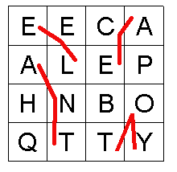
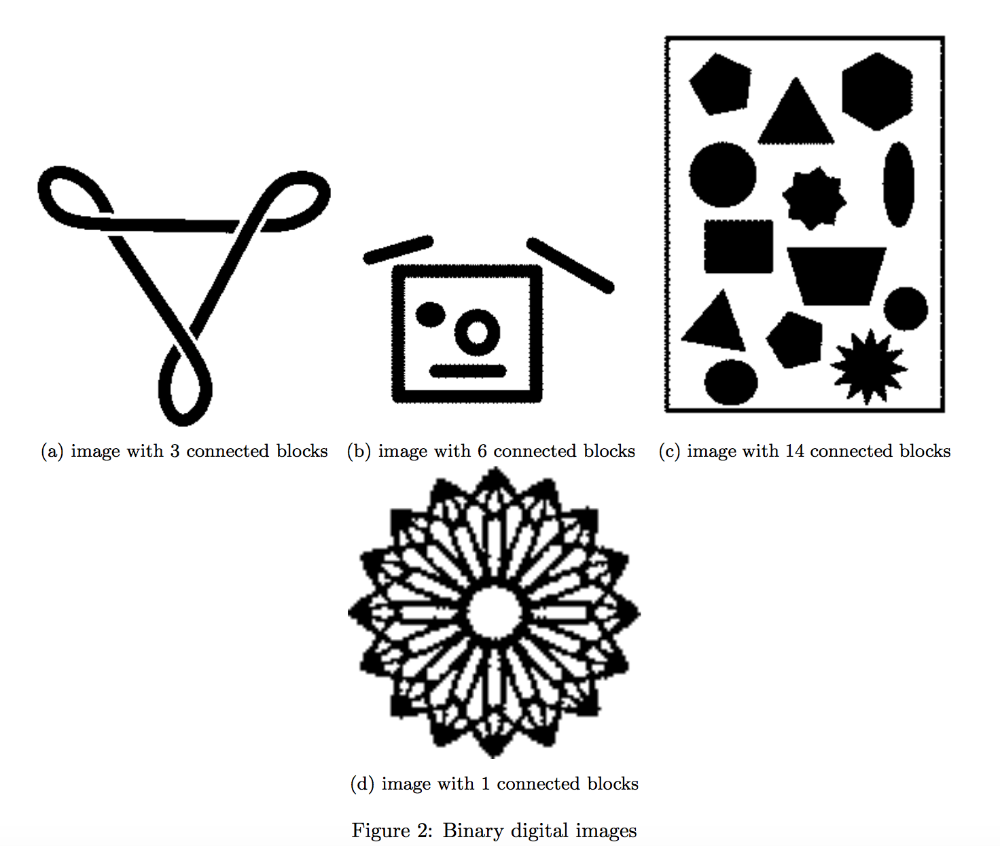

# Project 4: Recursion 
## Due Date: July 11, 2021 11:59 PM
## Assignment Type: Closed [(see policy)](http://www.cs.umd.edu/class/summer2019/cmsc132/openClosedPolicy.shtml)

# Overview
In this assignment, you will be completing a series of recursive functions in the classes given to you. 

# Objectives
This project is intended to familiarize you with recursive functions and recursive problem solving. **Proper solutions should use recursion and recursive helper functions.**

# Boggle Game Class
Boggle is a game where each player tries to find words in a grid of letters. The words are constructed so each letter in the word is adjacent to the next letter on the grid. You may not use the same cell on the grid more than once when constructing a word. See the figure bellow. 


## Layout of Project
```
src
  boggle
    BoggleGame.java
    Main.java
  imageblocks
    ImageBlacks.java
  tests
    Tests.java
    TestsSupport.java
  utils
    LetterGrid.java
    Picture.java
    SimpleGrid.java
```

## Usefull Class definitions

LetterGrid.java - holds the grid for the boggle game in a char[][].
                  Has a few methods which may be useful. Read through it.  

Picture.Java - Holds the picture for the ImageBlocks Class. 
Has a get(x,y) and a set(x,y) which can be used to set the color of a pixel.  

SimpleGrid.java - simple class that holds a test for Boggle

## Boggle Class

### instance variables

`LetterGrid grid` - The object that holds the letters.   
`Stack<String> path` - A stack object that stores the path of a word. Whether the top of the stack represents the 
last or first cahracter of the string is up to you as long as your `getWordPath(String word)` works correctly.   
`boolean[][] visited` - An array which we believe will be useful to tracking if you visited a cell or not. You do not have to use it. 

### Functions to Implement

```java
public boolean findWord(String word)
/*
* @param word - The word to find in the boggle game.
* @return true if word is found in grid or false if word is not found.
*/
```  
```java
public String findWordPath(String word)
/*
* @param word - the word whose path you are finding
* @return - a string in the format of "(col index0, row index1) (col index1, row index1) ..."
* If the word is not found, return the empty string.
* You can assume only one instance of the word exists
* For simplicity, you can assume the word is not apalindrome
* Look at testBoggleTwo() and SimpleGrid.java for an example output and what 'col index, row index' mean. 
* Example: for the board above, findWordPath("EEL") would return "(0,0)(0,1)(1,1)"
*/
```
```java
public int frequency(String word)
/*
* @param word - the word whose frequency you are finding
* @return - an int representing how many times the word exists on the grid.
* Palindromes count twice
*/
```

## ImageBlocks Class
The ImageBlocks class takes in a black and white picture with various shapes and continuous black blocks. You will implement three functions which process the image or list attributes about it.

### instance variables
`private int height` - An integer representing how many pixels are in the `pic`'s height.  
`private int width` - An integer representing how many pixels are in the `pic`'s width.  
`boolean[][] visited` - An array which we believe will be useful to tracking if you visited a cell or not. You do not have to use it.   
`Picture pic` - the Picture you are analyzing. Pixels in the image are either black or white

### functions to implement 
```java
public int CountConnectedBlocks()
/*
* @return - The number of connected blocks in the binary digital image found in 'pic'
* Connected blocks are black.
*/
```
For example, a black and white image with two separate black squares has two blocks and so the function will return 2. See the examples bellow:


```java
public Picture delete(int x, int y)
/*
* @param x - the x coordinate of the pixel in question
* @param y - the y coordinate of the pixel in question
* @return - the updated image.
* You will be deleting the entire connected block which contains the pixel (x,y)
* If (x,y) is not a black pixel, nothing should happne
* You can use pic.set(x,y, COLOR) to set a pixel's color of the 'pic' object.
* You should be modifying the 'pic' object, not creating a new one.
*/
```

## crop
```java
public Picture crop(int x_start, int x_end, int y_start, int y_end) {
/*
* @param x_start - the starting x coordinate 
* @param x_end - the ending x coordinate 
* @param y_start - the starting x coordinate 
* @param y_end  - the ending y coordinate
* @return - the updated image.
* Similar to delete, but you will be deleting all black pixesl outside of the bounds
* Bounds are inclusive, so do not delete anything that is on the border
* You can use pic.set(x,y, COLOR) to set a pixel's color of the 'pic' object.
* You should be modifying the 'pic' object, not creating a new one.
*/
```
Given a list of bounds, this function sets all black pixels outside of the bounds to white. The actual size of the image should not be changed.


# Grading
* Public Tests (35%)
* Release Tests (30%)
* Secret Tests (25%)

# Specification
In BoggleGame you must implement: `findWord`, `findWordPath`, and `frequency`.

In ImageBlocks you must implement: `CountConnectedBlocks`, `delete`, and `crop`

# Requirements/Project Policies
* You may not add any classes, but feel free to add any instance variables and private methods you understand are necessary.
* See [Style Guidelines](http://www.cs.umd.edu/class/summer2017/cmsc132/resources/StyleGuidelines.html) for information regarding style.
* We cannot provide any information regarding release and secret tests. Once your project has been graded, you can see a TA if you would like to find out why you failed a release or secret test.

# Testing
It is recommended that you test your own code using student tests.

# Submission
To submit your project, zip the project folder and upload the zipped file to gradescope.

# Academic Integrity
Please make sure you read the academic integrity section of the syllabus so you understand what is permissible in our programming projects. We want to remind you that we check your project against other students' projects and any case of academic dishonesty will be referred to the Office of Student Conduct. 
